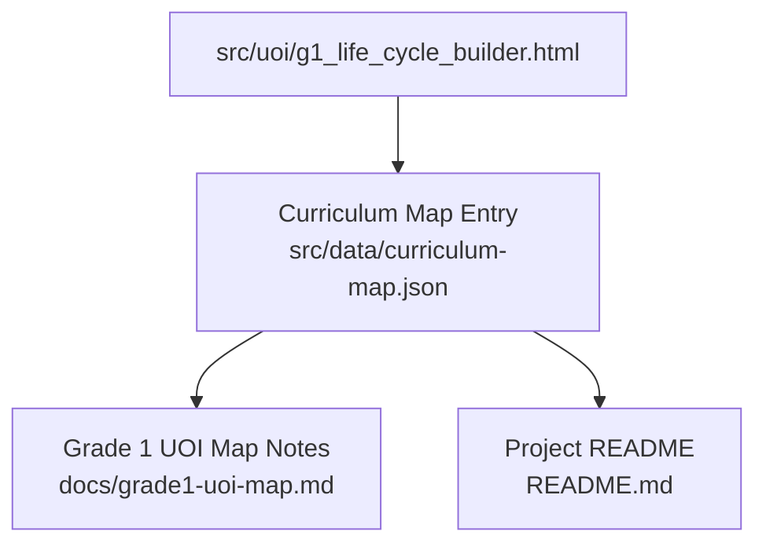
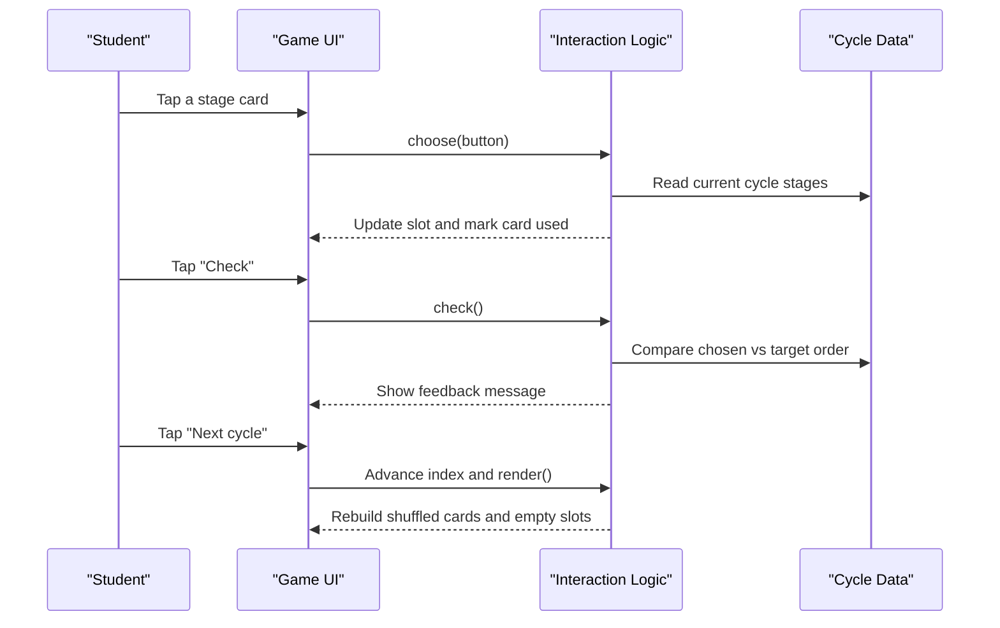
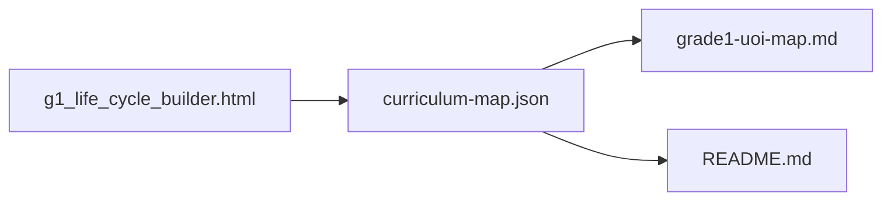
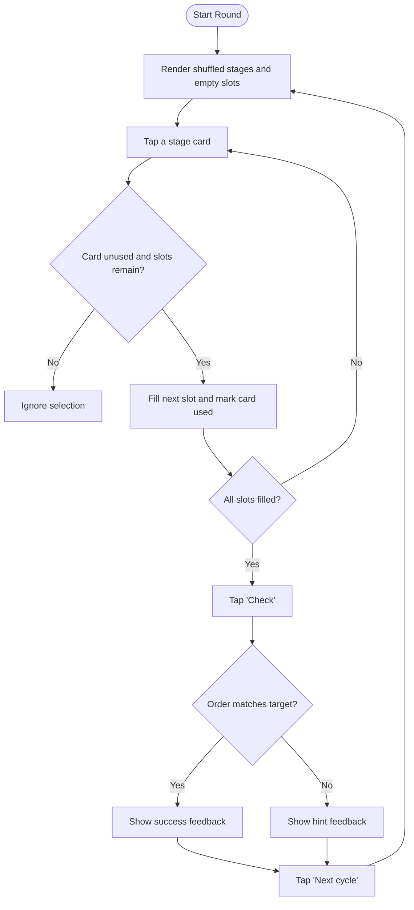

# Life Cycle Builder

<cite>
**Referenced Files in This Document**
- [g1_life_cycle_builder.html](file://src/uoi/g1_life_cycle_builder.html)
- [curriculum-map.json](file://src/data/curriculum-map.json)
- [grade1-uoi-map.md](file://docs/grade1-uoi-map.md)
- [README.md](file://README.md)
</cite>

## Table of Contents
1. [Introduction](#introduction)
2. [Project Structure](#project-structure)
3. [Core Components](#core-components)
4. [Architecture Overview](#architecture-overview)
5. [Detailed Component Analysis](#detailed-component-analysis)
6. [Dependency Analysis](#dependency-analysis)
7. [Performance Considerations](#performance-considerations)
8. [Troubleshooting Guide](#troubleshooting-guide)
9. [Conclusion](#conclusion)
10. [Appendices](#appendices)

## Introduction
Life Cycle Builder is a standalone, touch-friendly HTML5 activity for Grade 1 students that helps learners recognize and sequence the stages of natural cycles. The game presents multiple cycles (including animal and plant life cycles, as well as day/night and moon patterns), shuffles their stage cards, and asks students to place them into numbered slots in the correct order. Immediate feedback guides learners to reflect on what comes first, next, and last, reinforcing understanding of growth, change, and recurring patterns.

The activity aligns with IB PYP Unit 5 “How the World Works,” focusing on patterns and cycles in nature. It supports early science concepts such as metamorphosis in animals and germination in plants, while also connecting to broader ideas like adaptation and environmental factors through teacher-led extensions.

## Project Structure
Life Cycle Builder is implemented as a single-file HTML5 application located under the UOI folder. It includes embedded CSS and JavaScript, making it self-contained and easy to deploy. The curriculum map registers this activity under Grade 1, Unit 5, subject lane UOI.

**Diagram sources**
- [g1_life_cycle_builder.html:1-100](file://src/uoi/g1_life_cycle_builder.html#L1-L100)
- [curriculum-map.json:304-330](file://src/data/curriculum-map.json#L304-L330)
- [grade1-uoi-map.md:18-25](file://docs/grade1-uoi-map.md#L18-L25)
- [README.md:20-28](file://README.md#L20-L28)

**Section sources**
- [g1_life_cycle_builder.html:1-100](file://src/uoi/g1_life_cycle_builder.html#L1-L100)
- [curriculum-map.json:304-330](file://src/data/curriculum-map.json#L304-L330)
- [grade1-uoi-map.md:18-25](file://docs/grade1-uoi-map.md#L18-L25)
- [README.md:20-28](file://README.md#L20-L28)

## Core Components
- Data model: A small array of cycle objects defines each scenario’s title, icon, and ordered stages.
- Rendering engine: Builds shuffled stage buttons and empty numbered slots for user input.
- Interaction logic: Captures taps/clicks to fill slots sequentially, disables used cards, and prevents overfilling.
- Validation and feedback: Compares the chosen order against the target order and provides immediate, encouraging feedback.
- Navigation: A “Next cycle” button rotates through available cycles; a “Check” button validates the current attempt.

Key implementation references:
- Cycle data and icons: [g1_life_cycle_builder.html:55-60](file://src/uoi/g1_life_cycle_builder.html#L55-L60)
- Render function and event wiring: [g1_life_cycle_builder.html:68-77](file://src/uoi/g1_life_cycle_builder.html#L68-L77)
- Stage selection and slot filling: [g1_life_cycle_builder.html:79-86](file://src/uoi/g1_life_cycle_builder.html#L79-L86)
- Check logic and feedback messages: [g1_life_cycle_builder.html:88-92](file://src/uoi/g1_life_cycle_builder.html#L88-L92)
- Next cycle navigation: [g1_life_cycle_builder.html:95](file://src/uoi/g1_life_cycle_builder.html#L95)

**Section sources**
- [g1_life_cycle_builder.html:55-96](file://src/uoi/g1_life_cycle_builder.html#L55-L96)

## Architecture Overview
At runtime, the page initializes with a selected cycle, renders shuffled stage cards and empty slots, and listens for user interactions. When the learner taps a card, the app fills the next available slot and visually marks the card as used. Pressing “Check” compares the filled sequence to the expected order and updates the feedback area. “Next cycle” advances to the next entry in the cycle list and re-renders the board.

**Diagram sources**
- [g1_life_cycle_builder.html:68-96](file://src/uoi/g1_life_cycle_builder.html#L68-L96)

## Detailed Component Analysis

### Game Data Model
- Each cycle object contains:
  - title: Display name of the cycle
  - icon: Emoji or symbol representing the cycle
  - stages: Ordered array of stage labels
- Current cycles include:
  - Butterfly: Egg → Caterpillar → Chrysalis → Butterfly
  - Sunflower: Seed → Sprout → Plant → Flower
  - Day and Night: Morning → Afternoon → Evening → Night
  - Moon Pattern: New moon → Half moon → Full moon → Half moon again

Educational alignment:
- Animal metamorphosis and plant development are core elementary biology topics.
- Day/night and moon phases reinforce cyclical patterns in nature.

Implementation reference:
- [g1_life_cycle_builder.html:55-60](file://src/uoi/g1_life_cycle_builder.html#L55-L60)

**Section sources**
- [g1_life_cycle_builder.html:55-60](file://src/uoi/g1_life_cycle_builder.html#L55-L60)

### Stage Manipulation Mechanics
- Shuffling: On render, the stage list is randomly reordered so learners cannot rely on position memory.
- Selection: Tapping a card pushes its label into the chosen sequence and disables further use by marking it visually.
- Slot filling: Cards are placed into numbered slots in the order they are tapped.
- Guardrails: Prevents selecting already-used cards and stops adding more than the number of stages.

Implementation references:
- Shuffle and render: [g1_life_cycle_builder.html:66-77](file://src/uoi/g1_life_cycle_builder.html#L66-L77)
- Choose handler: [g1_life_cycle_builder.html:79-86](file://src/uoi/g1_life_cycle_builder.html#L79-L86)

**Section sources**
- [g1_life_cycle_builder.html:66-86](file://src/uoi/g1_life_cycle_builder.html#L66-L86)

### Visual Progression Indicators
- Numbered slots show progression from Stage 1 to the final stage.
- Filled slots receive a distinct background color to indicate completion.
- Used cards become semi-transparent to signal availability.
- Title and icon provide context for the current cycle.

Implementation references:
- Slot styling and state classes: [g1_life_cycle_builder.html:22-25](file://src/uoi/g1_life_cycle_builder.html#L22-L25)
- Card used style: [g1_life_cycle_builder.html:21](file://src/uoi/g1_life_cycle_builder.html#L21)
- Title/icon display: [g1_life_cycle_builder.html:71-72](file://src/uoi/g1_life_cycle_builder.html#L71-L72)

**Section sources**
- [g1_life_cycle_builder.html:21-25](file://src/uoi/g1_life_cycle_builder.html#L21-L25)
- [g1_life_cycle_builder.html:71-72](file://src/uoi/g1_life_cycle_builder.html#L71-L72)

### Educational Feedback
- If not all stages are selected, feedback prompts completion.
- If the order is correct, feedback affirms success and highlights pattern recognition.
- If incorrect, feedback encourages reflection (“what comes first, then what changes?”).

Implementation reference:
- [g1_life_cycle_builder.html:88-92](file://src/uoi/g1_life_cycle_builder.html#L88-L92)

**Section sources**
- [g1_life_cycle_builder.html:88-92](file://src/uoi/g1_life_cycle_builder.html#L88-L92)

### Curriculum Alignment and Scientific Accuracy
- Curriculum mapping:
  - Grade 1, Unit 5 “How the World Works,” subject lane UOI.
  - Central idea emphasizes adapting daily life to nature’s patterns and cycles.
- Scientific accuracy:
  - Butterfly metamorphosis follows egg → larva (caterpillar) → pupa (chrysalis) → adult (butterfly).
  - Sunflower development follows seed → sprout → plant → flower.
  - Day/night and moon phases represent natural cycles appropriate for early grades.
- Pedagogical fit:
  - Encourages sequencing skills, observation, and vocabulary building aligned with elementary science standards.

References:
- [curriculum-map.json:304-330](file://src/data/curriculum-map.json#L304-L330)
- [grade1-uoi-map.md:18-25](file://docs/grade1-uoi-map.md#L18-L25)

**Section sources**
- [curriculum-map.json:304-330](file://src/data/curriculum-map.json#L304-L330)
- [grade1-uoi-map.md:18-25](file://docs/grade1-uoi-map.md#L18-L25)

### Extensibility: Adding New Organism Life Cycles
To add a new organism or cycle:
- Add a new cycle object to the cycles array with title, icon, and ordered stages.
- Optionally adjust UI text or visuals if needed.
- Test by navigating through cycles and checking correctness.

Reference:
- [g1_life_cycle_builder.html:55-60](file://src/uoi/g1_life_cycle_builder.html#L55-L60)

**Section sources**
- [g1_life_cycle_builder.html:55-60](file://src/uoi/g1_life_cycle_builder.html#L55-L60)

### Complexity Levels
Current design targets ages 6–8 with minimal reading load and simple tap mechanics. To increase complexity:
- Introduce hints or partial sequences.
- Allow undo or swap operations.
- Provide multi-step explanations after successful completion.
- Add time-based challenges for older learners.

These enhancements can be layered onto the existing interaction flow without changing the core data model.

[No sources needed since this section provides general guidance]

### Connecting to Broader Ecological Concepts
Teachers can extend the activity to discuss:
- Adaptation: How different stages help organisms survive (e.g., chrysalis protection, seed dormancy).
- Environmental factors: Water, sunlight, temperature, and habitat needs at each stage.
- Human impact: Conservation and care for habitats during vulnerable stages.

[No sources needed since this section provides general guidance]

## Dependency Analysis
The activity is self-contained and has no external runtime dependencies. Its only structural dependency is registration in the curriculum map for discoverability within the hub.

**Diagram sources**
- [g1_life_cycle_builder.html:1-100](file://src/uoi/g1_life_cycle_builder.html#L1-L100)
- [curriculum-map.json:304-330](file://src/data/curriculum-map.json#L304-L330)
- [grade1-uoi-map.md:18-25](file://docs/grade1-uoi-map.md#L18-L25)
- [README.md:20-28](file://README.md#L20-L28)

**Section sources**
- [g1_life_cycle_builder.html:1-100](file://src/uoi/g1_life_cycle_builder.html#L1-L100)
- [curriculum-map.json:304-330](file://src/data/curriculum-map.json#L304-L330)
- [grade1-uoi-map.md:18-25](file://docs/grade1-uoi-map.md#L18-L25)
- [README.md:20-28](file://README.md#L20-L28)

## Performance Considerations
- Lightweight DOM operations: The app manipulates a small set of elements, keeping rendering fast.
- No heavy assets: Uses emojis and CSS for visuals, avoiding image loading overhead.
- Responsive layout: Grid and media queries ensure usability across devices.

[No sources needed since this section provides general guidance]

## Troubleshooting Guide
Common issues and resolutions:
- Stuck on one cycle: Ensure “Next cycle” is accessible and functional; verify index update and re-render.
- Incorrect feedback: Confirm comparison logic matches the target order length and indices.
- Touch responsiveness: Verify large touch targets and prevent double-tap issues by disabling used cards.

Implementation references:
- Next cycle navigation: [g1_life_cycle_builder.html:95](file://src/uoi/g1_life_cycle_builder.html#L95)
- Check logic: [g1_life_cycle_builder.html:88-92](file://src/uoi/g1_life_cycle_builder.html#L88-L92)
- Used card handling: [g1_life_cycle_builder.html:79-86](file://src/uoi/g1_life_cycle_builder.html#L79-L86)

**Section sources**
- [g1_life_cycle_builder.html:79-95](file://src/uoi/g1_life_cycle_builder.html#L79-L95)

## Conclusion
Life Cycle Builder offers a focused, age-appropriate experience for young learners to explore and sequence natural cycles. Its simple architecture, clear feedback, and curriculum alignment make it an effective tool for introducing foundational biology concepts. The design is easily extensible to include additional organisms, varied complexity levels, and connections to ecological themes such as adaptation and environmental factors.

[No sources needed since this section summarizes without analyzing specific files]

## Appendices

### Sequence Flowchart: Choosing and Checking Stages

**Diagram sources**
- [g1_life_cycle_builder.html:68-96](file://src/uoi/g1_life_cycle_builder.html#L68-L96)