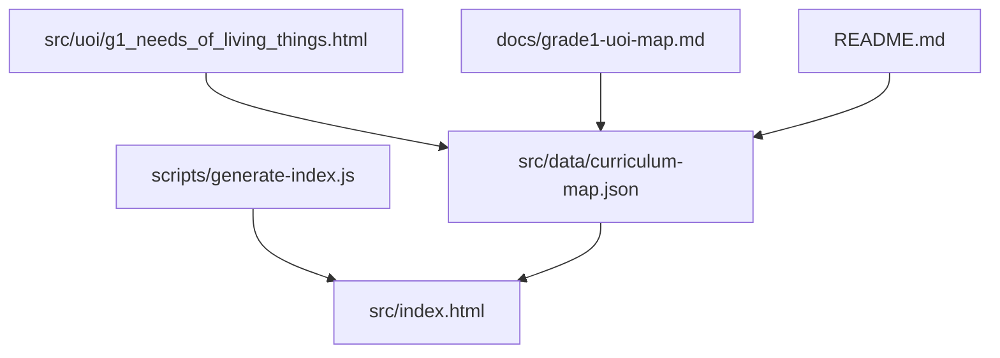
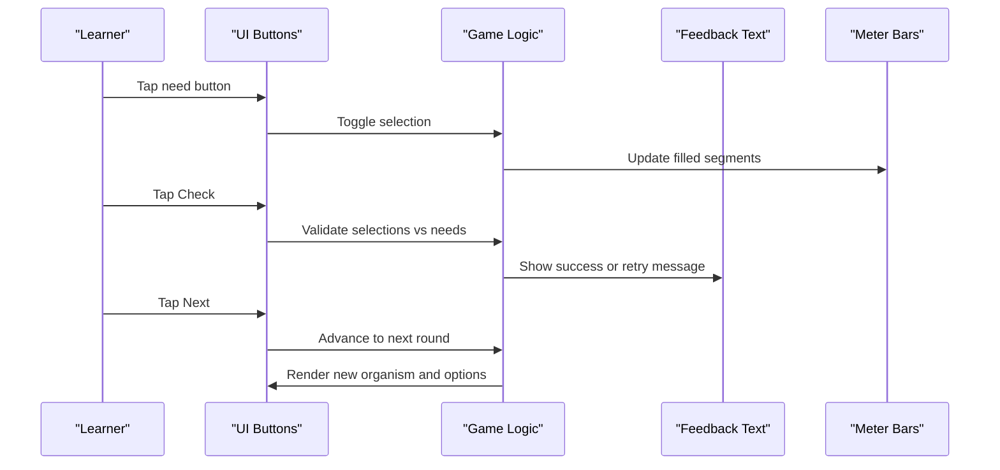
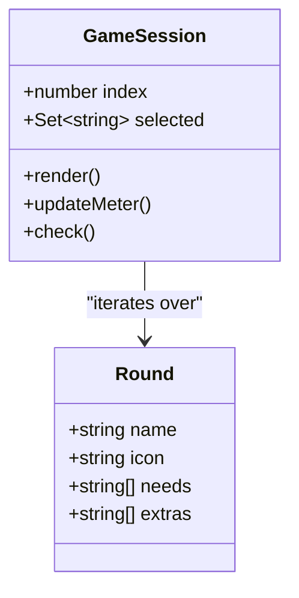
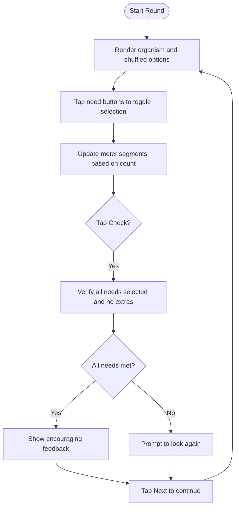
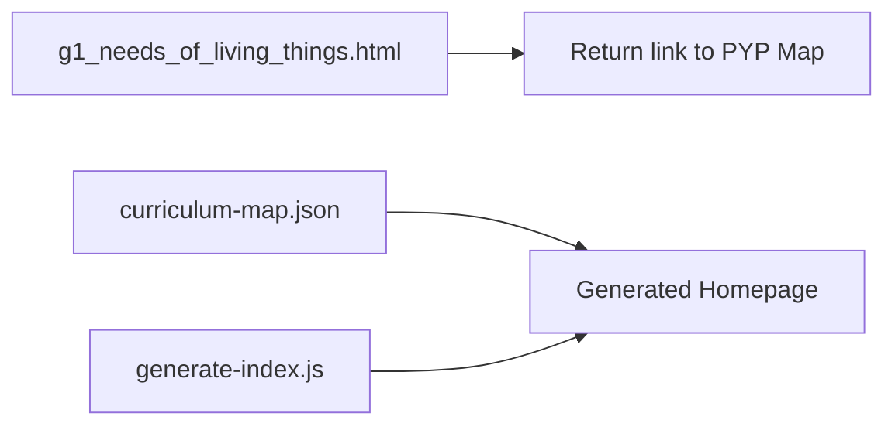

# Needs of Living Things

<cite>
**Referenced Files in This Document**
- [g1_needs_of_living_things.html](file://src/uoi/g1_needs_of_living_things.html)
- [curriculum-map.json](file://src/data/curriculum-map.json)
- [README.md](file://README.md)
- [grade1-uoi-map.md](file://docs/grade1-uoi-map.md)
- [generate-index.js](file://scripts/generate-index.js)
- [g1_living_things_eco_detective.html](file://src/math/g1_living_things_eco_detective.html)
</cite>

## Table of Contents
1. [Introduction](#introduction)
2. [Project Structure](#project-structure)
3. [Core Components](#core-components)
4. [Architecture Overview](#architecture-overview)
5. [Detailed Component Analysis](#detailed-component-analysis)
6. [Dependency Analysis](#dependency-analysis)
7. [Performance Considerations](#performance-considerations)
8. [Troubleshooting Guide](#troubleshooting-guide)
9. [Conclusion](#conclusion)
10. [Appendices](#appendices)

## Introduction
Needs of Living Things is a science-integrated exploration activity for Grade 1 learners within the IB PYP Unit 4 “Sharing the Planet.” It helps students identify what living organisms need to survive and thrive by matching needs to different organisms (plants, animals, and humans). The activity uses an interactive matching mechanic where learners select needs from a shuffled list and receive immediate feedback. Visual representations include emoji icons and a simple progress meter that fills as correct needs are selected. The design supports inquiry-based learning by prompting observation, hypothesis testing (“What does this organism need?”), and reflection on interdependence in ecosystems.

The activity aligns with the central idea: “Respecting and protecting living things helps them survive and thrive,” and encourages caring and principled learner profiles through choices that support survival.

## Project Structure
This activity is a standalone HTML5 page located under the UOI folder and is registered in the curriculum map so it appears in the generated homepage. The project follows a clear structure:
- Standalone UOI games live in src/uoi/.
- Curriculum metadata lives in src/data/curriculum-map.json.
- The homepage is generated from the curriculum map using scripts/generate-index.js.
- Documentation and QA guidance are in docs/.

**Diagram sources**
- [g1_needs_of_living_things.html:1-100](file://src/uoi/g1_needs_of_living_things.html#L1-L100)
- [curriculum-map.json:227-302](file://src/data/curriculum-map.json#L227-L302)
- [generate-index.js:701-734](file://scripts/generate-index.js#L701-L734)
- [grade1-uoi-map.md:1-76](file://docs/grade1-uoi-map.md#L1-L76)
- [README.md:1-65](file://README.md#L1-L65)

**Section sources**
- [README.md:1-65](file://README.md#L1-L65)
- [grade1-uoi-map.md:1-76](file://docs/grade1-uoi-map.md#L1-L76)
- [curriculum-map.json:227-302](file://src/data/curriculum-map.json#L227-L302)
- [generate-index.js:701-734](file://scripts/generate-index.js#L701-L734)

## Core Components
- Organism rounds: Each round defines an organism’s name, icon, required needs, and distractor items.
- Interaction layer: Learners tap buttons representing potential needs; selection toggles and updates a visual meter.
- Validation logic: On “Check,” the system verifies whether all true needs are selected and no extras are included.
- Feedback loop: Immediate textual feedback guides learners toward scientific reasoning about needs.
- Navigation: “Next living thing” cycles through rounds.

Key educational scaffolding:
- Clear prompts and large touch targets support early readers and tablet use.
- Meter provides visual progress toward meeting all needs.
- Distractors encourage discrimination between helpful and non-helpful items.
- Encourages real-world connections by naming concrete resources (e.g., water, sunlight, soil, air, safe home).

**Section sources**
- [g1_needs_of_living_things.html:52-96](file://src/uoi/g1_needs_of_living_things.html#L52-L96)

## Architecture Overview
At runtime, the page renders a two-panel layout:
- Left panel shows the current organism and a four-segment meter.
- Right panel presents shuffled need options and action buttons.

User interactions update state and UI, then validation checks correctness and displays feedback.

**Diagram sources**
- [g1_needs_of_living_things.html:65-96](file://src/uoi/g1_needs_of_living_things.html#L65-L96)

## Detailed Component Analysis

### Game Data Model
The game uses a small array of rounds. Each round includes:
- name: Organism label
- icon: Emoji representation
- needs: Array of essential requirements
- extras: Distractor items not needed by the organism

This model keeps content accessible and easy to extend without complex dependencies.

**Diagram sources**
- [g1_needs_of_living_things.html:52-96](file://src/uoi/g1_needs_of_living_things.html#L52-L96)

**Section sources**
- [g1_needs_of_living_things.html:52-96](file://src/uoi/g1_needs_of_living_things.html#L52-L96)

### Matching Mechanics and Flow
The flow centers on selection, validation, and progression:

**Diagram sources**
- [g1_needs_of_living_things.html:65-96](file://src/uoi/g1_needs_of_living_things.html#L65-L96)

**Section sources**
- [g1_needs_of_living_things.html:65-96](file://src/uoi/g1_needs_of_living_things.html#L65-L96)

### Visual Representations
- Organisms are shown with a large emoji and name for quick recognition.
- Need buttons are large and clearly labeled.
- The meter uses color-coded bars to reflect progress toward meeting all needs.

These visuals reduce cognitive load and support early literacy and accessibility.

**Section sources**
- [g1_needs_of_living_things.html:16-27](file://src/uoi/g1_needs_of_living_things.html#L16-L27)

### Educational Scaffolding and Inquiry Support
- Prompt text guides learners to choose needs and check their work.
- Feedback messages reinforce scientific ideas (what helps vs. what does not).
- Shuffled options promote reasoning rather than memorization.
- The activity connects to real-world observations (water, food, shelter/safe home, air) and invites discussion about ecosystems and interdependence.

**Section sources**
- [g1_needs_of_living_things.html:33-48](file://src/uoi/g1_needs_of_living_things.html#L33-L48)
- [g1_needs_of_living_things.html:87-92](file://src/uoi/g1_needs_of_living_things.html#L87-L92)

### Alignment with IB PYP and Cross-Curricular Connections
- Unit alignment: The activity is mapped to Unit 4 “Living Things” under the theme “Sharing the Planet.”
- Central idea connection: Choices that meet needs demonstrate respect and protection of living things.
- Related activities: The Eco Detective Mission complements this activity by exploring living/non-living classification and data collection, reinforcing ecosystem concepts.

**Section sources**
- [curriculum-map.json:227-302](file://src/data/curriculum-map.json#L227-L302)
- [g1_living_things_eco_detective.html:1-200](file://src/math/g1_living_things_eco_detective.html#L1-L200)

## Dependency Analysis
- The activity is self-contained: CSS and JavaScript are embedded in the HTML file.
- It links back to the PYP Map via a return link.
- The curriculum map registers the activity path and description, enabling navigation from the generated homepage.
- The generate script builds the homepage from the curriculum map.

**Diagram sources**
- [g1_needs_of_living_things.html:31-35](file://src/uoi/g1_needs_of_living_things.html#L31-L35)
- [curriculum-map.json:246-251](file://src/data/curriculum-map.json#L246-L251)
- [generate-index.js:701-734](file://scripts/generate-index.js#L701-L734)

**Section sources**
- [g1_needs_of_living_things.html:31-35](file://src/uoi/g1_needs_of_living_things.html#L31-L35)
- [curriculum-map.json:246-251](file://src/data/curriculum-map.json#L246-L251)
- [generate-index.js:701-734](file://scripts/generate-index.js#L701-L734)

## Performance Considerations
- Lightweight single-file design ensures fast load times and minimal dependencies.
- DOM updates are simple and efficient (toggle classes, rebuild small lists).
- No external assets are required beyond standard fonts if used elsewhere; this activity relies on emojis and CSS variables.

[No sources needed since this section provides general guidance]

## Troubleshooting Guide
- If the activity does not appear on the homepage:
  - Ensure the entry exists in the curriculum map with the correct path and title.
  - Regenerate the homepage using the build process.
- If the activity fails to render correctly:
  - Verify viewport meta tag and responsive styles are present.
  - Confirm the return link points to the PYP Map.
- If interactions do not respond:
  - Check that event listeners are attached to buttons and that selection state updates the meter.

**Section sources**
- [README.md:50-56](file://README.md#L50-L56)
- [g1_needs_of_living_things.html:31-35](file://src/uoi/g1_needs_of_living_things.html#L31-L35)
- [g1_needs_of_living_things.html:73-96](file://src/uoi/g1_needs_of_living_things.html#L73-L96)

## Conclusion
Needs of Living Things offers a focused, inquiry-driven experience that introduces foundational biological concepts through interactive matching. Its simple architecture, clear visuals, and immediate feedback make it suitable for young learners while supporting cross-curricular connections and extension opportunities.

[No sources needed since this section summarizes without analyzing specific files]

## Appendices

### How to Expand the Organism Database
- Add new rounds to the rounds array with name, icon, needs, and extras.
- Keep needs aligned with core categories (water, food, shelter/safe home, air) and consider environment-specific variants (e.g., “Air in water”).
- Shuffle remains automatic; ensure extras are plausible but incorrect to maintain challenge.

**Section sources**
- [g1_needs_of_living_things.html:52-56](file://src/uoi/g1_needs_of_living_things.html#L52-L56)

### How to Add New Need Categories
- Introduce additional need labels in new rounds’ needs arrays.
- Adjust the meter length dynamically if you want more than four segments per round.
- Update feedback messaging to reflect expanded categories.

**Section sources**
- [g1_needs_of_living_things.html:71-85](file://src/uoi/g1_needs_of_living_things.html#L71-L85)

### Creating Cross-Curricular Connections
- Literacy: Use vocabulary cards for needs terms; have learners write sentences explaining why each need matters.
- Math: Record counts of organisms needing each resource across rounds; create simple pictographs or tally charts.
- Science: Connect to the Eco Detective Mission to classify living/non-living and explore habitats.
- Chinese 中文: Explore nature-related radicals and vocabulary related to water, sun, soil, and air.

**Section sources**
- [curriculum-map.json:227-302](file://src/data/curriculum-map.json#L227-L302)
- [g1_living_things_eco_detective.html:1-200](file://src/math/g1_living_things_eco_detective.html#L1-L200)