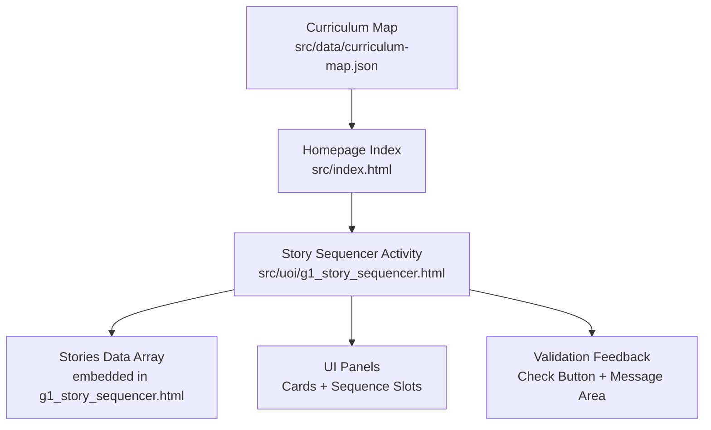
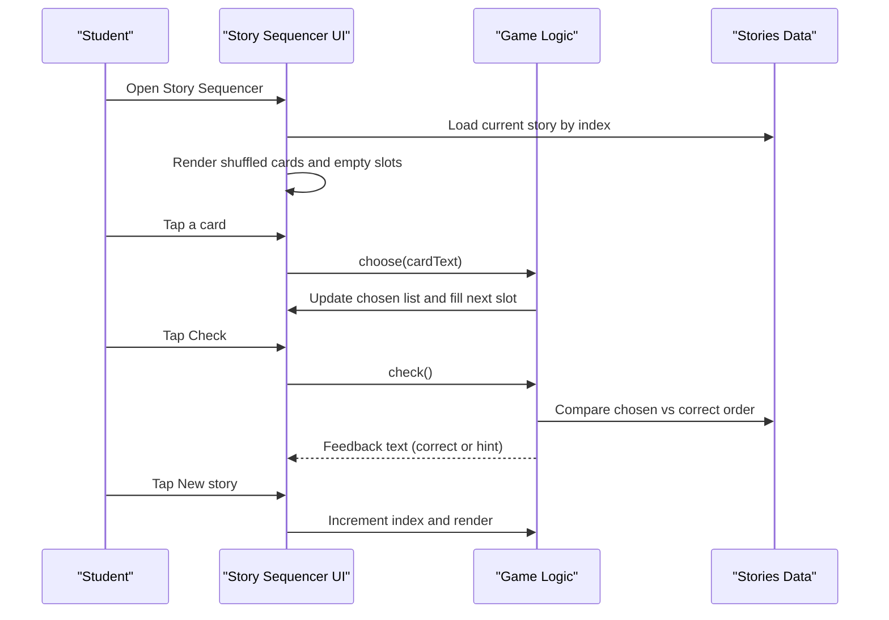
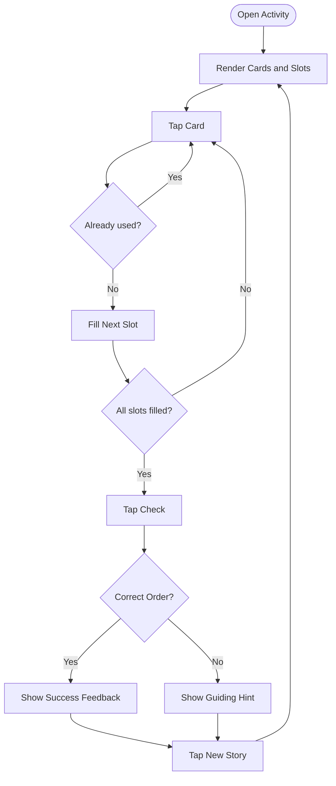
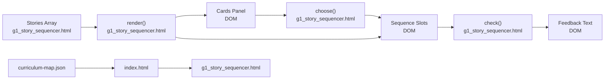

# Story Sequencer

<cite>
**Referenced Files in This Document**
- [g1_story_sequencer.html](file://src/uoi/g1_story_sequencer.html)
- [curriculum-map.json](file://src/data/curriculum-map.json)
- [index.html](file://src/index.html)
- [README.md](file://README.md)
</cite>

## Table of Contents
1. [Introduction](#introduction)
2. [Project Structure](#project-structure)
3. [Core Components](#core-components)
4. [Architecture Overview](#architecture-overview)
5. [Detailed Component Analysis](#detailed-component-analysis)
6. [Dependency Analysis](#dependency-analysis)
7. [Performance Considerations](#performance-considerations)
8. [Troubleshooting Guide](#troubleshooting-guide)
9. [Conclusion](#conclusion)
10. [Appendices](#appendices)

## Introduction
The Story Sequencer is an interactive narrative comprehension activity designed for early learners. It presents a short story as three event cards shuffled into random order and asks students to place them into Beginning, Middle, and End slots to build a coherent narrative. The game provides immediate feedback on whether the sequence is correct and highlights the story’s message to reinforce reading comprehension and cause-and-effect reasoning.

Educational benefits:
- Reading comprehension: Students identify key events and their logical order.
- Cause-and-effect reasoning: Learners connect actions and outcomes across time.
- Narrative structure understanding: Reinforces beginning-middle-end organization and thematic messages.

## Project Structure
The Story Sequencer is implemented as a standalone HTML5 activity with embedded CSS and JavaScript. It is integrated into the IB PYP Grade 1 curriculum map under Unit 3 (Storytelling) and also linked from Unit 6 (Journeys).

**Diagram sources**
- [curriculum-map.json:200-225](file://src/data/curriculum-map.json#L200-L225)
- [index.html:648-654](file://src/index.html#L648-L654)
- [g1_story_sequencer.html:54-118](file://src/uoi/g1_story_sequencer.html#L54-L118)

**Section sources**
- [README.md:28-28](file://README.md#L28-L28)
- [curriculum-map.json:200-225](file://src/data/curriculum-map.json#L200-L225)
- [index.html:648-654](file://src/index.html#L648-L654)

## Core Components
- Stories data array: Contains multiple stories, each with a title, ordered card texts, and a reflective message.
- UI panels:
  - Story cards panel: Displays shuffled cards for selection.
  - My sequence panel: Shows Beginning, Middle, End slots that fill as cards are selected.
- Interaction logic:
  - Click-to-select mechanic (tap-friendly).
  - Shuffling of initial card order.
  - Validation against the correct sequence.
  - Feedback area with encouraging prompts.
- Controls:
  - Check button to validate current sequence.
  - New story button to cycle to the next story.

Key implementation references:
- Stories data and rendering: [g1_story_sequencer.html:55-83](file://src/uoi/g1_story_sequencer.html#L55-L83), [g1_story_sequencer.html:92-100](file://src/uoi/g1_story_sequencer.html#L92-L100)
- Selection and slot filling: [g1_story_sequencer.html:102-109](file://src/uoi/g1_story_sequencer.html#L102-L109)
- Validation and feedback: [g1_story_sequencer.html:111-114](file://src/uoi/g1_story_sequencer.html#L111-L114)
- Controls and navigation: [g1_story_sequencer.html:116-118](file://src/uoi/g1_story_sequencer.html#L116-L118)

**Section sources**
- [g1_story_sequencer.html:55-83](file://src/uoi/g1_story_sequencer.html#L55-L83)
- [g1_story_sequencer.html:92-100](file://src/uoi/g1_story_sequencer.html#L92-L100)
- [g1_story_sequencer.html:102-109](file://src/uoi/g1_story_sequencer.html#L102-L109)
- [g1_story_sequencer.html:111-114](file://src/uoi/g1_story_sequencer.html#L111-L114)
- [g1_story_sequencer.html:116-118](file://src/uoi/g1_story_sequencer.html#L116-L118)

## Architecture Overview
The activity follows a simple client-side architecture:
- Data-driven: Stories are defined in a local array.
- DOM-driven UI: Cards and slots are rendered via innerHTML updates.
- Event-driven interactions: Click handlers manage selection and validation.
- No external dependencies: All logic is self-contained within the single HTML file.

**Diagram sources**
- [g1_story_sequencer.html:92-100](file://src/uoi/g1_story_sequencer.html#L92-L100)
- [g1_story_sequencer.html:102-109](file://src/uoi/g1_story_sequencer.html#L102-L109)
- [g1_story_sequencer.html:111-114](file://src/uoi/g1_story_sequencer.html#L111-L114)
- [g1_story_sequencer.html:116-118](file://src/uoi/g1_story_sequencer.html#L116-L118)

## Detailed Component Analysis

### Data Model: Stories Array
- Structure: Each story includes a title, an ordered array of card strings, and a message string.
- Purpose: Provides content for the activity and defines the correct sequence for validation.
- Complexity: O(n) where n is number of stories; typically small (e.g., 3–5 entries).

References:
- [g1_story_sequencer.html:55-83](file://src/uoi/g1_story_sequencer.html#L55-L83)

**Section sources**
- [g1_story_sequencer.html:55-83](file://src/uoi/g1_story_sequencer.html#L55-L83)

### Rendering Engine: render()
- Responsibilities:
  - Reset chosen state.
  - Select current story by index.
  - Shuffle and render cards.
  - Create empty Beginning/Middle/End slots.
  - Display story message and initial feedback.
  - Attach click listeners to cards.
- Performance: Minimal DOM updates; suitable for small datasets.

References:
- [g1_story_sequencer.html:92-100](file://src/uoi/g1_story_sequencer.html#L92-L100)

**Section sources**
- [g1_story_sequencer.html:92-100](file://src/uoi/g1_story_sequencer.html#L92-L100)

### Interaction Handler: choose(card)
- Behavior:
  - Prevents reusing already used cards.
  - Limits total selections to three.
  - Appends selected card text to chosen list.
  - Marks card as used visually.
  - Fills the next available slot and marks it filled.
- Accessibility: Large touch targets and clear visual states support young learners.

References:
- [g1_story_sequencer.html:102-109](file://src/uoi/g1_story_sequencer.html#L102-L109)

**Section sources**
- [g1_story_sequencer.html:102-109](file://src/uoi/g1_story_sequencer.html#L102-L109)

### Validation System: check()
- Logic:
  - Compares chosen order with the correct order using element-wise equality.
  - If fewer than three cards are selected, prompts completion.
  - If correct, confirms success.
  - If incorrect, offers a guiding hint about first/next/last.
- Educational value: Encourages reflection on chronological thinking and narrative flow.

References:
- [g1_story_sequencer.html:111-114](file://src/uoi/g1_story_sequencer.html#L111-L114)

**Section sources**
- [g1_story_sequencer.html:111-114](file://src/uoi/g1_story_sequencer.html#L111-L114)

### Controls and Navigation
- Check button triggers validation.
- New story button cycles through stories by incrementing index modulo length and re-rendering.

References:
- [g1_story_sequencer.html:116-118](file://src/uoi/g1_story_sequencer.html#L116-L118)

**Section sources**
- [g1_story_sequencer.html:116-118](file://src/uoi/g1_story_sequencer.html#L116-L118)

### User Flow Diagram

[No sources needed since this diagram shows conceptual workflow, not actual code structure]

## Dependency Analysis
- Internal dependencies:
  - UI elements referenced by IDs: cards, sequence, feedback, message.
  - Local functions: render, choose, check.
  - Local data: stories array.
- External dependencies:
  - None; fully self-contained HTML5 file.
- Curriculum integration:
  - Listed under Grade 1, Unit 3 (Storytelling) and Unit 6 (Journeys) in the curriculum map.
  - Linked from the generated homepage.

**Diagram sources**
- [g1_story_sequencer.html:92-100](file://src/uoi/g1_story_sequencer.html#L92-L100)
- [g1_story_sequencer.html:102-109](file://src/uoi/g1_story_sequencer.html#L102-L109)
- [g1_story_sequencer.html:111-114](file://src/uoi/g1_story_sequencer.html#L111-L114)
- [curriculum-map.json:200-225](file://src/data/curriculum-map.json#L200-L225)
- [index.html:648-654](file://src/index.html#L648-L654)

**Section sources**
- [curriculum-map.json:200-225](file://src/data/curriculum-map.json#L200-L225)
- [index.html:648-654](file://src/index.html#L648-L654)

## Performance Considerations
- Dataset size: Small arrays of strings; negligible memory footprint.
- DOM operations: Rebuilding innerHTML per render is acceptable for small sets; consider caching nodes if scaling up.
- Event listeners: Attaching listeners during render is straightforward; ensure removal or rebind only when necessary.
- Responsiveness: Layout uses CSS Grid and media queries for tablet/desktop-first design.

[No sources needed since this section provides general guidance]

## Troubleshooting Guide
Common issues and resolutions:
- Cards do not fill slots:
  - Ensure cards are not marked used and fewer than three selections have been made.
  - Verify click listeners are attached after render.
- Incorrect feedback always shown:
  - Confirm chosen array matches expected order exactly.
  - Check that story index points to the intended story.
- New story does not change:
  - Verify index increment and modulo operation.
  - Ensure render resets chosen state and rebuilds UI.

Operational references:
- [g1_story_sequencer.html:102-109](file://src/uoi/g1_story_sequencer.html#L102-L109)
- [g1_story_sequencer.html:111-114](file://src/uoi/g1_story_sequencer.html#L111-L114)
- [g1_story_sequencer.html:116-118](file://src/uoi/g1_story_sequencer.html#L116-L118)

**Section sources**
- [g1_story_sequencer.html:102-109](file://src/uoi/g1_story_sequencer.html#L102-L109)
- [g1_story_sequencer.html:111-114](file://src/uoi/g1_story_sequencer.html#L111-L114)
- [g1_story_sequencer.html:116-118](file://src/uoi/g1_story_sequencer.html#L116-L118)

## Conclusion
The Story Sequencer is a focused, accessible tool for developing early narrative comprehension skills. Its simple click-based interaction, clear feedback, and embedded messages align well with IB PYP learning goals around storytelling and expression. The activity is easy to extend with new stories and can be adapted for different complexity levels by adjusting card count and language.

[No sources needed since this section summarizes without analyzing specific files]

## Appendices

### How to Add New Stories
- Steps:
  - Add a new object to the stories array with title, ordered cards, and message.
  - Optionally adjust the shuffle function behavior if you want deterministic ordering for testing.
  - Save and reload the page; the New story control will include the new entry.
- References:
  - [g1_story_sequencer.html:55-83](file://src/uoi/g1_story_sequencer.html#L55-L83)
  - [g1_story_sequencer.html:92-100](file://src/uoi/g1_story_sequencer.html#L92-L100)

**Section sources**
- [g1_story_sequencer.html:55-83](file://src/uoi/g1_story_sequencer.html#L55-L83)
- [g1_story_sequencer.html:92-100](file://src/uoi/g1_story_sequencer.html#L92-L100)

### Implementing Different Story Types
- Beginning-Middle-End:
  - Use three-card stories emphasizing setup, development, and resolution.
- Problem-Solution:
  - Frame cards to highlight a problem, attempts to solve it, and the outcome.
- Reflection prompts:
  - Adjust the message field to guide discussion about cause-and-effect and character choices.
- References:
  - [g1_story_sequencer.html:55-83](file://src/uoi/g1_story_sequencer.html#L55-L83)

**Section sources**
- [g1_story_sequencer.html:55-83](file://src/uoi/g1_story_sequencer.html#L55-L83)

### Adapting Complexity Levels
- Younger learners:
  - Keep three cards with simple sentences and clear temporal cues.
- Older learners:
  - Increase card count (requires extending slots and validation).
  - Introduce optional hints or partial feedback.
- References:
  - [g1_story_sequencer.html:102-109](file://src/uoi/g1_story_sequencer.html#L102-L109)
  - [g1_story_sequencer.html:111-114](file://src/uoi/g1_story_sequencer.html#L111-L114)

**Section sources**
- [g1_story_sequencer.html:102-109](file://src/uoi/g1_story_sequencer.html#L102-L109)
- [g1_story_sequencer.html:111-114](file://src/uoi/g1_story_sequencer.html#L111-L114)

### Integration Notes
- Curriculum mapping:
  - The Story Sequencer appears under Unit 3 (Storytelling) and Unit 6 (Journeys) in the curriculum map.
- Homepage link:
  - The generated index links directly to the activity.
- References:
  - [curriculum-map.json:200-225](file://src/data/curriculum-map.json#L200-L225)
  - [index.html:648-654](file://src/index.html#L648-L654)

**Section sources**
- [curriculum-map.json:200-225](file://src/data/curriculum-map.json#L200-L225)
- [index.html:648-654](file://src/index.html#L648-L654)