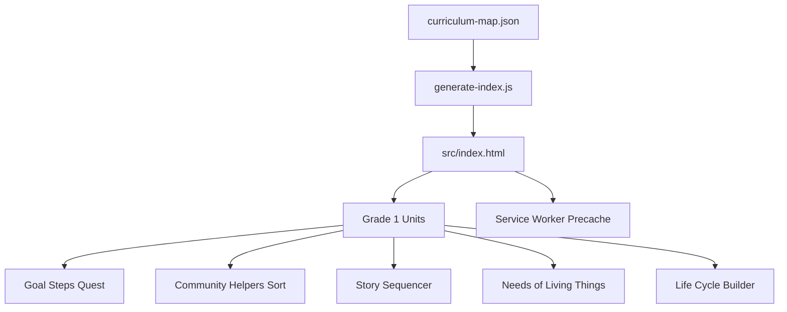
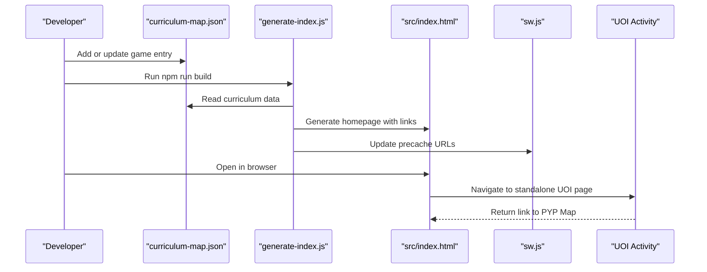
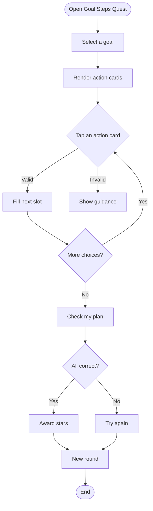
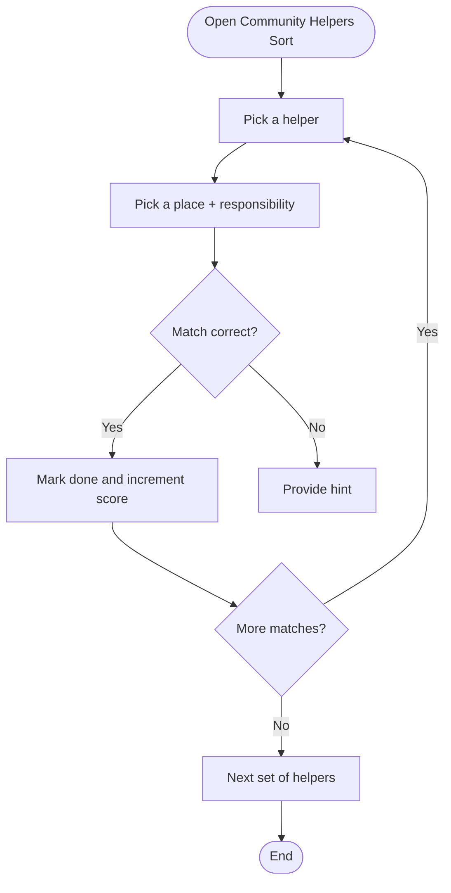
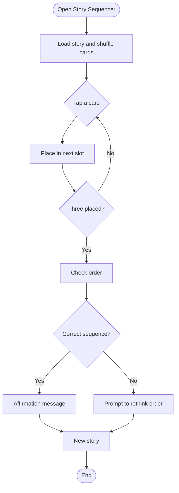
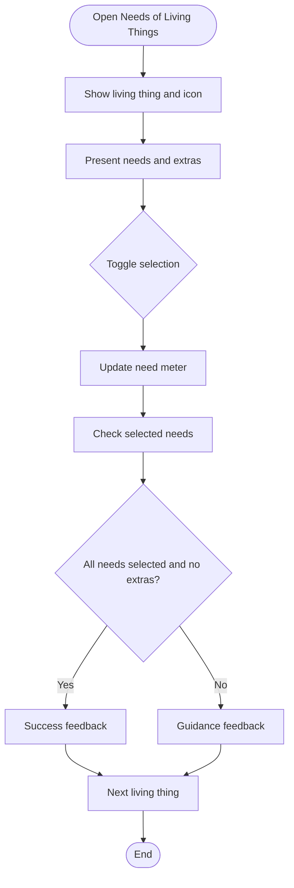
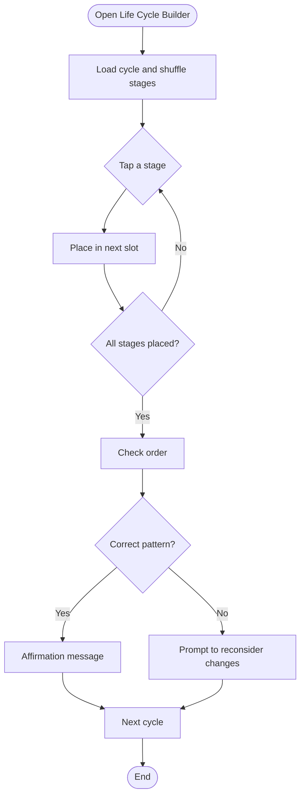
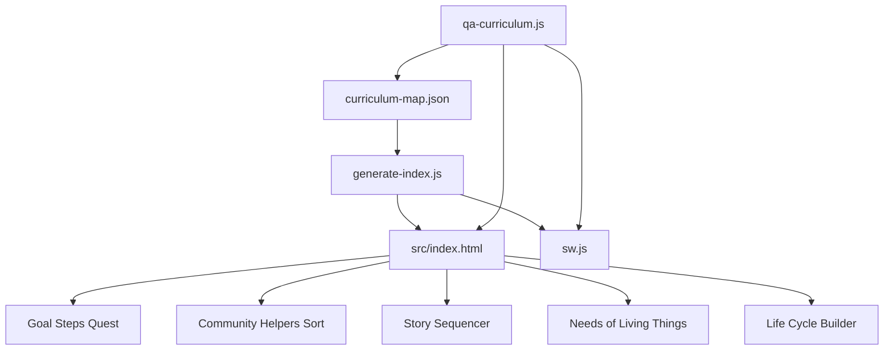
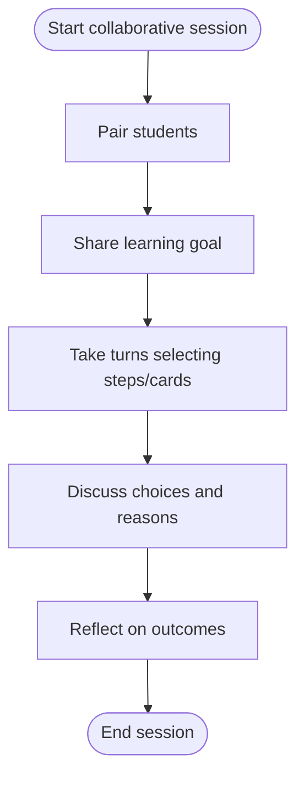

# Unit of Inquiry Activities

<cite>
**Referenced Files in This Document**
- [README.md](file://README.md)
- [curriculum-map.json](file://src/data/curriculum-map.json)
- [grade1-uoi-map.md](file://docs/grade1-uoi-map.md)
- [manual-visual-qa.md](file://docs/manual-visual-qa.md)
- [generate-index.js](file://scripts/generate-index.js)
- [index.html](file://src/index.html)
- [qa-curriculum.js](file://scripts/qa-curriculum.js)
- [g1_goal_steps_quest.html](file://src/uoi/g1_goal_steps_quest.html)
- [g1_community_helpers_sort.html](file://src/uoi/g1_community_helpers_sort.html)
- [g1_story_sequencer.html](file://src/uoi/g1_story_sequencer.html)
- [g1_needs_of_living_things.html](file://src/uoi/g1_needs_of_living_things.html)
- [g1_life_cycle_builder.html](file://src/uoi/g1_life_cycle_builder.html)
- [g2_vocabulary.html](file://src/uoi/g2_vocabulary.html)
</cite>

## Table of Contents
1. [Introduction](#introduction)
2. [Project Structure](#project-structure)
3. [Core Components](#core-components)
4. [Architecture Overview](#architecture-overview)
5. [Detailed Component Analysis](#detailed-component-analysis)
6. [Dependency Analysis](#dependency-analysis)
7. [Performance Considerations](#performance-considerations)
8. [Troubleshooting Guide](#troubleshooting-guide)
9. [Conclusion](#conclusion)
10. [Appendices](#appendices)

## Introduction
This document explains the Unit of Inquiry (UOI) activities that showcase transdisciplinary learning aligned with the IB Primary Years Programme (PYP). The project provides standalone HTML5 activities for Grade 1 across five inquiry units, each integrating multiple subject areas around a central idea and learner profile. The activities are designed to be portable, touch-friendly, and assessment-capable, while encouraging critical thinking and real-world connections.

The UOI activities included:
- Goal Steps Quest for planning and reflection
- Community Helpers Sort for social studies exploration
- Story Sequencer for narrative comprehension
- Needs of Living Things for science integration
- Life Cycle Builder for biological processes

These activities are mapped within a curriculum-driven homepage that connects UOI with Literacy, Math, Science, and Chinese 中文 practice.

**Section sources**
- [README.md:1-65](file://README.md#L1-L65)
- [grade1-uoi-map.md:1-76](file://docs/grade1-uoi-map.md#L1-L76)

## Project Structure
The repository organizes content by grade, unit, and subject lanes. The source of truth is a JSON map that drives a generated homepage and service worker precache. Standalone UOI games live under src/uoi as single-file HTML5 activities with embedded CSS and JavaScript.

**Diagram sources**
- [curriculum-map.json:1-551](file://src/data/curriculum-map.json#L1-L551)
- [generate-index.js:1-800](file://scripts/generate-index.js#L1-L800)
- [index.html:1-800](file://src/index.html#L1-L800)

Key structural notes:
- The homepage is generated from the curriculum map; do not hand-edit index.html.
- Each new UOI activity must be added to the map and validated via QA scripts.
- All standalone UOI games include viewport meta tags, large touch targets, and return links to the PYP map.

**Section sources**
- [README.md:20-28](file://README.md#L20-L28)
- [grade1-uoi-map.md:35-46](file://docs/grade1-uoi-map.md#L35-L46)
- [qa-curriculum.js:17-32](file://scripts/qa-curriculum.js#L17-L32)

## Core Components
The core components are the five standalone UOI activities plus the supporting infrastructure that generates the navigation and ensures quality.

- Goal Steps Quest: Students select a goal and choose three small action steps to support growth. Encourages self-management and reflective thinking.
- Community Helpers Sort: Students match helpers to places and responsibilities, building understanding of community roles.
- Story Sequencer: Students arrange beginning, middle, and end cards to build coherent narratives and reflect on messages.
- Needs of Living Things: Students identify essential needs for different living things and evaluate survival conditions.
- Life Cycle Builder: Students order stages of natural cycles to recognize patterns of change.

Each activity is self-contained, responsive, and includes immediate feedback for formative assessment.

**Section sources**
- [g1_goal_steps_quest.html:1-193](file://src/uoi/g1_goal_steps_quest.html#L1-L193)
- [g1_community_helpers_sort.html:1-122](file://src/uoi/g1_community_helpers_sort.html#L1-L122)
- [g1_story_sequencer.html:1-122](file://src/uoi/g1_story_sequencer.html#L1-L122)
- [g1_needs_of_living_things.html:1-100](file://src/uoi/g1_needs_of_living_things.html#L1-L100)
- [g1_life_cycle_builder.html:1-100](file://src/uoi/g1_life_cycle_builder.html#L1-L100)

## Architecture Overview
The system uses a data-driven architecture where the curriculum map defines grades, units, subjects, and game entries. A generator script reads this map and produces the homepage and service worker precache URLs. Standalone UOI games are linked from the generated pages and remain independent.

**Diagram sources**
- [curriculum-map.json:1-551](file://src/data/curriculum-map.json#L1-L551)
- [generate-index.js:1-800](file://scripts/generate-index.js#L1-L800)
- [index.html:1-800](file://src/index.html#L1-L800)

## Detailed Component Analysis

### Goal Steps Quest
Purpose: Support planning and reflection by choosing small actions toward a learning goal.

Interaction flow:
- Select a goal
- Choose three action steps
- Check plan and receive feedback
- Reset for next round

**Diagram sources**
- [g1_goal_steps_quest.html:100-193](file://src/uoi/g1_goal_steps_quest.html#L100-L193)

Assessment opportunities:
- Immediate feedback indicates whether chosen steps align with the goal.
- Star counter provides simple progress tracking.

IB PYP alignment:
- Theme: Who We Are
- Learner Profile: Reflective, Balanced
- ATL Skills: Self-management, Thinking

**Section sources**
- [g1_goal_steps_quest.html:1-193](file://src/uoi/g1_goal_steps_quest.html#L1-L193)
- [curriculum-map.json:80-118](file://src/data/curriculum-map.json#L80-L118)

### Community Helpers Sort
Purpose: Explore community roles and responsibilities through matching tasks.

Interaction flow:
- Tap a helper
- Tap a place/responsibility pair
- Receive feedback and mark matches
- Advance to new helpers

**Diagram sources**
- [g1_community_helpers_sort.html:55-122](file://src/uoi/g1_community_helpers_sort.html#L55-L122)

Assessment opportunities:
- Score tracking shows number of correct matches.
- Feedback guides reasoning about roles and responsibilities.

IB PYP alignment:
- Theme: How We Organize Ourselves
- Learner Profile: Caring, Communicator
- ATL Skills: Social Skills, Communication Skills

**Section sources**
- [g1_community_helpers_sort.html:1-122](file://src/uoi/g1_community_helpers_sort.html#L1-L122)
- [curriculum-map.json:120-183](file://src/data/curriculum-map.json#L120-L183)

### Story Sequencer
Purpose: Build narrative comprehension by ordering beginning, middle, and end.

Interaction flow:
- View story title and message
- Shuffle story cards
- Place cards into sequence slots
- Check order and receive feedback
- Move to next story

**Diagram sources**
- [g1_story_sequencer.html:54-122](file://src/uoi/g1_story_sequencer.html#L54-L122)

Assessment opportunities:
- Immediate validation of sequence order.
- Message display reinforces thematic meaning.

IB PYP alignment:
- Theme: How We Express Ourselves
- Learner Profile: Open-Minded, Communicator
- ATL Skills: Social Skills, Thinking Skills

**Section sources**
- [g1_story_sequencer.html:1-122](file://src/uoi/g1_story_sequencer.html#L1-L122)
- [curriculum-map.json:185-225](file://src/data/curriculum-map.json#L185-L225)

### Needs of Living Things
Purpose: Integrate science concepts by identifying essential needs for different organisms.

Interaction flow:
- Display living thing and icon
- Present needs and extras
- Toggle selections and update meter
- Check correctness and provide feedback
- Advance to next living thing

**Diagram sources**
- [g1_needs_of_living_things.html:51-100](file://src/uoi/g1_needs_of_living_things.html#L51-L100)

Assessment opportunities:
- Meter visualizes partial progress.
- Feedback distinguishes between correct needs and distractors.

IB PYP alignment:
- Theme: Sharing the Planet
- Learner Profile: Caring, Principled
- ATL Skills: Research Skills, Self-management Skills

**Section sources**
- [g1_needs_of_living_things.html:1-100](file://src/uoi/g1_needs_of_living_things.html#L1-L100)
- [curriculum-map.json:227-302](file://src/data/curriculum-map.json#L227-L302)

### Life Cycle Builder
Purpose: Teach biological and natural cycles by arranging stages in correct order.

Interaction flow:
- Display cycle title and icon
- Shuffle stage cards
- Place stages into ordered slots
- Check sequence and provide feedback
- Advance to next cycle

**Diagram sources**
- [g1_life_cycle_builder.html:54-100](file://src/uoi/g1_life_cycle_builder.html#L54-L100)

Assessment opportunities:
- Immediate validation of stage order.
- Feedback encourages noticing patterns of change.

IB PYP alignment:
- Theme: How the World Works
- Learner Profile: Inquirer, Knowledgeable
- ATL Skills: Research Skills, Thinking Skills

**Section sources**
- [g1_life_cycle_builder.html:1-100](file://src/uoi/g1_life_cycle_builder.html#L1-L100)
- [curriculum-map.json:304-387](file://src/data/curriculum-map.json#L304-L387)

### Conceptual Overview
The UOI activities follow a consistent interaction model:
- Single-page, standalone HTML5 files
- Embedded CSS and JavaScript
- Large touch targets and responsive layouts
- Immediate feedback and optional scoring
- Return link to the PYP map

This design ensures portability and ease of use across devices, particularly iPad landscape and desktop.

[No sources needed since this section doesn't analyze specific files]

## Dependency Analysis
The dependency chain centers on the curriculum map and the generator script. The generated homepage links to all mapped games and updates the service worker precache. QA checks ensure consistency and compliance with design expectations.

**Diagram sources**
- [curriculum-map.json:1-551](file://src/data/curriculum-map.json#L1-L551)
- [generate-index.js:1-800](file://scripts/generate-index.js#L1-L800)
- [index.html:1-800](file://src/index.html#L1-L800)
- [qa-curriculum.js:1-292](file://scripts/qa-curriculum.js#L1-L292)

Key dependencies:
- Curriculum map entries drive homepage generation and service worker caching.
- QA script validates presence of viewport meta tags, return links, and standalone constraints.
- Generated index enforces responsive media queries and avoids external dependencies for UOI games.

**Section sources**
- [generate-index.js:109-149](file://scripts/generate-index.js#L109-L149)
- [qa-curriculum.js:100-274](file://scripts/qa-curriculum.js#L100-L274)

## Performance Considerations
- Standalone UOI activities avoid external scripts/stylesheets, reducing network requests and improving load times.
- Responsive CSS uses minimal media queries and grid layouts for efficient rendering on tablets and desktops.
- Simple DOM manipulation and event listeners keep interactions lightweight.
- Service worker precaching improves offline access for mapped pages.

[No sources needed since this section provides general guidance]

## Troubleshooting Guide
Common issues and resolutions:
- Missing viewport meta tag: Ensure each UOI HTML file includes a viewport meta tag.
- Incorrect return link: Verify the PYP Map link points to the relative path expected by the QA script.
- External dependencies: Remove any external script or stylesheet references in new UOI games.
- Touch target size: Confirm buttons meet minimum sizing requirements for comfortable touch interaction.
- Tablet responsiveness: Include appropriate media queries for tablet viewports.

Validation commands:
- Run npm run qa:curriculum to check curriculum coverage and standalone rules.
- Run npm run build to regenerate the homepage and service worker cache.

**Section sources**
- [qa-curriculum.js:206-274](file://scripts/qa-curriculum.js#L206-L274)
- [README.md:41-48](file://README.md#L41-L48)

## Conclusion
The UOI activities provide a cohesive, transdisciplinary learning experience aligned with IB PYP themes. They integrate multiple subject areas, promote critical thinking, and offer formative assessment through immediate feedback. The standalone architecture ensures portability and accessibility, while the curriculum-driven homepage and QA pipeline maintain consistency and quality.

[No sources needed since this section summarizes without analyzing specific files]

## Appendices

### Creating a New UOI Activity
Steps:
- Create a new standalone HTML5 file under src/uoi with embedded CSS and JavaScript.
- Include a viewport meta tag, large touch targets, and a return link to the PYP map.
- Add an entry in curriculum-map.json under the appropriate grade and unit.
- Run npm run qa:curriculum and npm run build to validate and generate the homepage.

Examples of existing UOI activities:
- [g1_goal_steps_quest.html](file://src/uoi/g1_goal_steps_quest.html)
- [g1_community_helpers_sort.html](file://src/uoi/g1_community_helpers_sort.html)
- [g1_story_sequencer.html](file://src/uoi/g1_story_sequencer.html)
- [g1_needs_of_living_things.html](file://src/uoi/g1_needs_of_living_things.html)
- [g1_life_cycle_builder.html](file://src/uoi/g1_life_cycle_builder.html)

**Section sources**
- [README.md:50-57](file://README.md#L50-L57)
- [grade1-uoi-map.md:35-46](file://docs/grade1-uoi-map.md#L35-L46)

### Embedding Multimedia Content
Guidelines:
- Use inline SVG or emoji icons to avoid external assets.
- If audio is required, trigger playback only after user gestures.
- Keep media lightweight and accessible.

Example reference:
- [g2_vocabulary.html](file://src/uoi/g2_vocabulary.html) demonstrates inline SVG illustrations and voice selection controls.

**Section sources**
- [g2_vocabulary.html:1-800](file://src/uoi/g2_vocabulary.html#L1-L800)

### Designing for Collaborative Learning
Recommendations:
- Provide clear prompts and shared goals visible to peers.
- Use turn-taking mechanics (e.g., selecting one step at a time).
- Include discussion prompts in feedback messages.

Conceptual workflow diagram:

[No sources needed since this diagram shows conceptual workflow, not actual code structure]

### Alignment with IB PYP Transdisciplinary Themes and Assessment Criteria
Mapping:
- Unit 1: Who We Are — Goal Steps Quest
- Unit 2: How We Organize Ourselves — Community Helpers Sort
- Unit 3: How We Express Ourselves — Story Sequencer
- Unit 4: Sharing the Planet — Needs of Living Things
- Unit 5: How the World Works — Life Cycle Builder

Assessment criteria:
- Formative feedback within activities supports ongoing evaluation.
- Scoring elements (stars, matches) provide simple metrics for progress.
- Reflection prompts encourage metacognition and self-assessment.

**Section sources**
- [curriculum-map.json:80-387](file://src/data/curriculum-map.json#L80-L387)
- [manual-visual-qa.md:63-81](file://docs/manual-visual-qa.md#L63-L81)