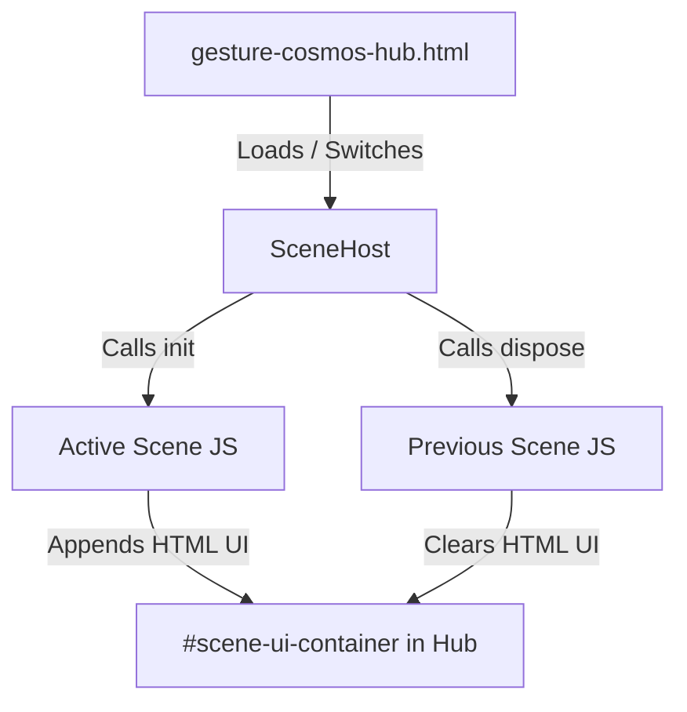

# Design Spec: Gesture Cosmos Hub UX Restoration

## Overview
This design outlines the restoration of full interactive controls, HUD overlays, OrbitControls mouse/touch fallback, and scene-specific configurations for the 6 cosmic environments inside `src/science/gesture-cosmos/`. 

Rather than reverting the games to 6 independent HTML files, we will keep the single, performance-optimized, single-canvas Gesture Cosmos Hub structure, but bring back the original rich interactivity, sidebars, titles, HUDs, and fallback mouse controls.

---

## Proposed UI & Controls Architecture

To avoid cluttering the parent hub layout, the hub page `src/science/gesture-cosmos-hub.html` will contain a dedicated `#scene-ui-container` element. 
Each scene module (e.g., `scene-solar-system.js`, `scene-neon-planets.js`, etc.) will be responsible for:
1. Dynamically creating its HUD and control sidebar (buttons, titles, info panels) inside `#scene-ui-container` on `init(ctx)`.
2. Setting up event listeners (click, touch) on these buttons to drive the 3D scene parameters or focus states.
3. Completely removing its custom DOM elements from `#scene-ui-container` on `dispose()`.

---

## Detailed Scene UX Fixes

### 1. OrbitControls Fallback in `CameraRig`
- **Issue:** Currently, if hand tracking is disabled or camera access is denied, there is no mouse orbit or zoom control because `OrbitControls` is missing.
- **Solution:**
  - Import `OrbitControls` from `three/addons/controls/OrbitControls.js` inside `camera-rig.js`.
  - Instantiate `OrbitControls` bound to the camera and renderer's DOM element.
  - In `CameraRig.update()`, call `orbitControls.update()` so OrbitControls' normal damping and mouse/touch drag events work out of the box.
  - In `CameraRig.applyCommand(cmd)`:
    - If `cmd` is null or not moving, let `OrbitControls` handle input.
    - If `cmd` has gesture orbit (`dx`, `dy`) or pinch (`zoomFactor`), programmatically update the camera position on the spherical shell relative to the current `orbitControls.target` and call `orbitControls.update()`.

### 2. Solar System (`scene-solar-system.js`)
- **UX to Restore:**
  - Sidebar panel with buttons: `Overview`, `Sun`, `Mercury`, `Venus`, `Earth`, `Mars`, `Jupiter`, `Saturn`, `Uranus`, `Neptune`.
  - Clicking a planet button smoothly transitions the camera to focus on it.
  - Clicking `Overview` returns the camera to the full solar system view.
  - Selecting a planet via pointer raycast updates the active sidebar button.

### 3. Neon Planets (`scene-neon-planets.js`)
- **UX to Restore:**
  - Top-left HUD title displaying the active planet (e.g., `SUN`) and subtitle `Unit 5: Patterns and Cycles`.
  - Right sidebar with planet buttons: `Sun`, `Mer`, `Ven`, `Ear`, `Mar`, `Jup`, `Sat`, `Ura`, `Nep`.
  - Clicking a button disposes of the current planet group, calls `loadPlanet(name)`, and updates the HUD.

### 4. Spiral Galaxy (`scene-galaxy-spiral.js`)
- **UX to Restore:**
  - Bottom-left HUD title displaying the active galaxy name and subtitle `Unit 5: Patterns and Cycles`.
  - Top-right status indicator showing tracking status (e.g. `MOUSE CONTROL` or `GESTURE DETECTED`) and FPS.
  - Right sidebar with galaxy buttons: `Milky Way`, `Andromeda`, `Whirlpool (M51)`, `Sombrero`, `Cosmic Nebula`.
  - Clicking a button generates the selected galaxy and updates the HUD.

### 5. Crystal Galaxy (`scene-crystal-galaxy.js`)
- **UX to Restore:**
  - Bottom-left HUD showing active galaxy name (e.g. `MILKY WAY`) and subtitle `200,000 DISCRETE PARTICLES`.
  - Right sidebar with galaxy buttons: `MILKY WAY`, `ANDROMEDA`, `WHIRLPOOL`, `SOMBRERO`.
  - Clicking a button disposes of the current galaxy, generates the selected one, and updates the HUD.

### 6. Milky Way (`scene-milky-way.js`)
- **UX to Restore:**
  - Right sidebar with buttons: `Milky Way (Real)`, `Andromeda`, `Whirlpool (M51)`, `Sombrero (M104)`.
  - Bottom-left HUD showing the name and subtitle.

### 7. Shape Lab (`scene-shape-motion.js`)
- **UX to Restore:**
  - Sidebar buttons to switch shapes: `Heart`, `Flower`, `Saturn`, `Helix`, `Sphere`, `Galaxy`.
  - Auto-color toggle button.
  - Clicking a shape button morphs the particles smoothly to the target coordinates.
  - Clicking Auto color cycles the particle system color hue.

---

## Verification Plan

### Automated Tests
- Run `npm run qa:curriculum` to ensure curriculum validity.
- Run `npm run build` to verify PWA and index generation.

### Manual Verification
- Open the dev server and test:
  1. Mouse dragging and wheel zooming inside the hub.
  2. Switching tabs (all custom HTML panels from the previous scene must be cleared and the new scene's HUD/controls correctly loaded).
  3. Clicking sidebar buttons in all 6 scenes to verify configuration change (e.g., shape morphing, loading planets, switching galaxies, and camera transitions).
